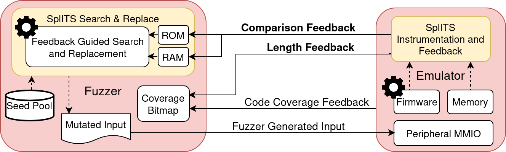

# SplITS

SplITS is an automated fuzzing framework focused on solving magic strings in monolithic firmware. We support firmware built for ARM Cortex-M microcontrollers. Our feedback guided search efficiently identifies non-contiguous bytes that are used to form a string, allowing them to be easily replaced. We also include additional coverage instrumentation to ensure test inputs that load strings of suitable lengths for replacement are saved for further fuzzing.

You can read the full paper, accepted to ESORICS '23, regarding our work [here](https://arxiv.org/abs/2308.07860).

# Cite Us
```
@inproceedings{splits,
title = {{SplITS}: Split Input-to-State Mapping for Effective Firmware Fuzzing},
author = {Guy Farrelly and Paul Quirk and Salil S. Kanhere and Seyit Camtepe and Damith C. Ranasinghe},
booktitle = {Proceedings of the 28th European Symposium on Research in Computer Security (ESORICS)},
year = {2023}
}
```

# Installing SplITS
SplITS is implemented on top of Fuzzware, and follows a similar installation process. We provide the following commands as an example based on Ubuntu 20.04.

```bash
# install dependencies
sudo apt install python2 python3 automake redis-server tmux cmake clang unzip python3-pip
pip3 install virtualenvwrapper
# check the output of pip3 incase commands have to be run to configure the environment

# clone SplITS
git clone https://github.com/SplITS-Fuzzer/SplITS

# get submodules
cd SplITS
git submodule update --init --recursive

# compile
cd fuzzware
./install_local.sh
```
# Repository Structure
```
- fuzzware                  Main Fuzzer Implementation, built on the existing Fuzzware framework
- SplITS-Experiments        Repository for SplITS Experimentation
    - Crashes               Scripts and Inputs for Reproduction of Newly Discovered Crashes
    - Fuzzing               Dataset for Fuzzing Test Binaries
- Images                    Miscellaneous items for documentation
- README                    Installation and Operating Instructions
```

# Instructions
SplITS can used using the Fuzzware style commands. AFL++ mode with Split Input To State is enabled by default.

From a folder with an appripriate config file, run the following commands to start a 24 hour fuzzing campaign:

```bash
workon fuzzware
fuzzware pipeline --run-for 24:00:00
```

More details on interacting with Fuzzware to run and analyse fuzzing campaigns are available [here.](https://github.com/fuzzware-fuzzer/fuzzware)

# Overview of SplITS
SplITS allows Split Input To State mapping and replacement for non-contiguous strings. In particular, it is focused on string replacement in monolithic firmware fuzzing.

By repeatedly monitoring the contents of memory buffers during execution of mutated test cases, the byte corresponding to each byte used to form a string can be identified.

To assist in forming suitable test cases for replacement, we include additional coverage instrumentation to give feedback to the fuzzer when it discovers inputs that load sufficient data into string buffers used in comparisons.



SplITS is built using [AFLplusplus](https://github.com/SplITS-Fuzzer/AFLplusplus) for the fuzzer, and [Fuzzware](https://github.com/SplITS-Fuzzer/fuzzware) for emulation.

# Experiments
Information regarding our experiments and results are made available [here.](https://github.com/SplITS-Fuzzer/SplITS-Experiments)

# Found an issue?
If you encounter an issue using SplITS please open an [issue](https://github.com/SplITS-Fuzzer/SplITS/issues).
